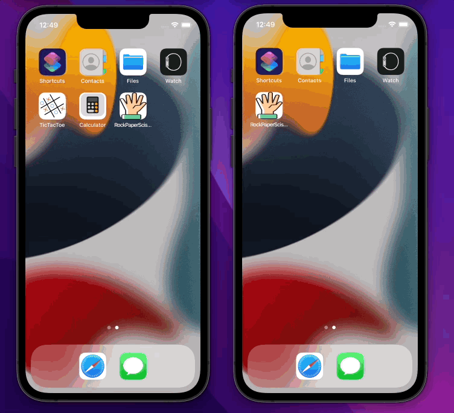
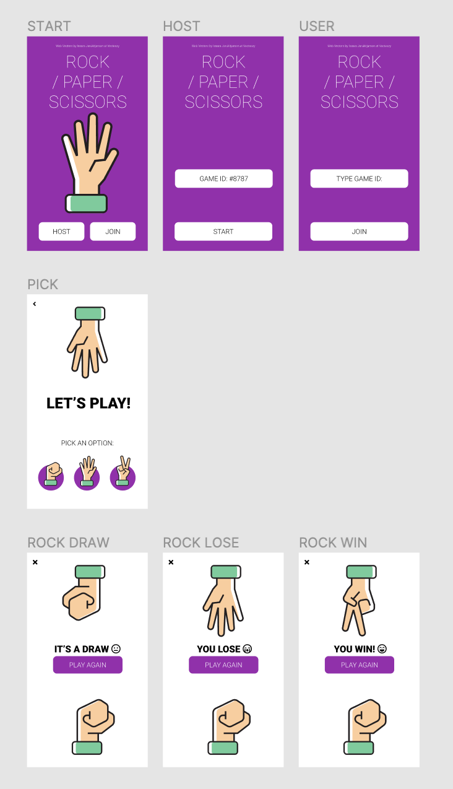
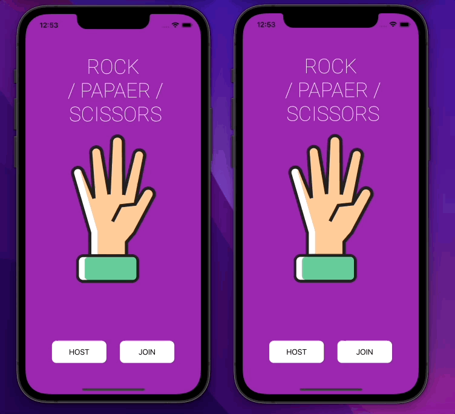

# RockPaperScissors
RockPaperScissors is an app where you can play classic "rock, paper, scissors game" with friends on your phones.  
Using Firebase you can connect via auto-generated ID or by passing your own game ID when creating a game as a host.  

## Demo of an app

  

## Design 
This app is based on [Figma design by João](https://www.figma.com/community/file/1010460624388193913) which I have slightly modified.  
  

## Description

This app is a classic rock-paper-scissors game.  
Here are the main features includes in it:
- user can host a game with autogenerated ID or create a game with their own ID
- guest can join game created by user by providing game ID
- using Firebase DB data about chosen moves are saved and results are being shown

## Game with own game ID
  

## Future improvments:
- I will clear the code and add comments 
-    
Made with ♥️ in Swift.
